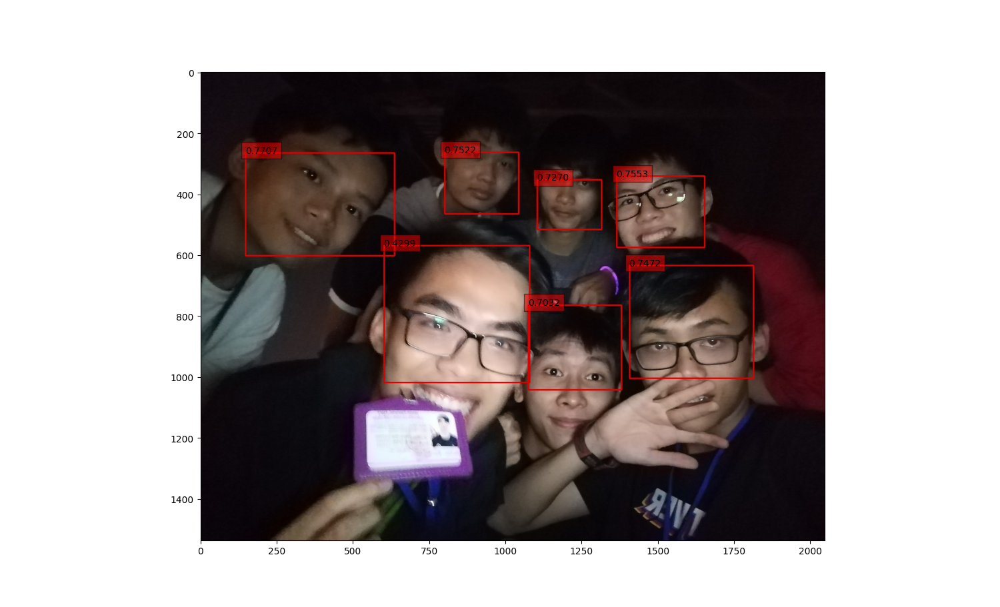

# FaceDetection-CenterNet
Face detection with CenterNet
## Why I wrote this repository  
First, the orginal repo implemented CenterNet had unupdated DCNv2, so you can't use CenterNet with higher version pytorch. Same as you, I had been very tired to reinstall DCNv2 through it related to many factors about gpu, torch version, cuda ... So I came up the idea to implement my custom CenterNet so that I can you it in some future AI competitions (cause I'm very like the feeling when joining to compete with other people, win or lose not important, you can learn many things from it).  

Second, I want to know more about the CenterNet, what those function works and how heatmap can help the model performs efficiently. So I think rewrite the paper through coding  is the best way I can figure out my questions.  
## About the dataset  
Why faces? I want to try the other object detection dataset, so instead of using coco, pascal ... I used human face dataset from google dataset.  

## Result of detecting on an image  

