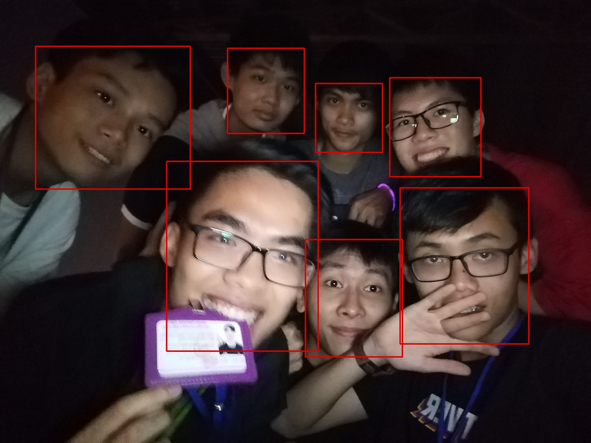

# FaceDetection-CenterNet
Face detection with CenterNet
## New in this repository  
- DCNv2 with torch version 1.4  
- Simple implementation  
## Installation  
- Clone this repository  
- Setup DCNv2  
- Install required packages follow [this](https://github.com/huynhtuan17ti/FaceDetection-CenterNet/blob/main/REQUIREMENTS.md)  
## About the dataset  
Human Face dataset from [Open Image Dataset](https://opensource.google/projects/open-images-dataset)  

## Result of detecting on an image  

## To do  
- [x] Train with widerface dataset (will update later)  
- [ ] Experience with more models  
- [ ] Add face recognition in previous [repository](https://github.com/huynhtuan17ti/FaceNet-OneShotLearning)
